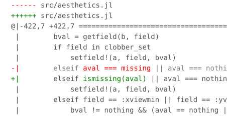

  

<h1 align="center">
  ShowLint
</h1>

<h3 align="center">
  Showing static code analysis results for open source repositories
</h3>

Linters have obvious benefits but, like any tool, can be hard to use.
Not all users have the time to install a linter and inspect its output.
Also, some linters show many false-positives and cause the code to be littered with ignore X comments.
Another problem is that any suggestion by the linter is only interesting once.
After a decision is made on applying the suggestion, the suggestion should not come back.

So, I figured that it might be useful to periodically generate the lint results for many repositories and show the results on a website.
